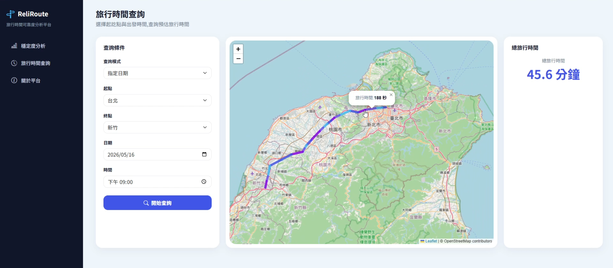

# Highway Travel Time Analysis

以台灣高速公路局 M04A 站間各車種中位數旅行時間歷史資料為基礎，針對約 13 億筆資料進行資料處理與旅行時間計算，建立可依使用者輸入條件，利用歷史資料即時計算兩地間旅行時間的分析系統。

> 此專案為小組專題。本儲存庫包含小組開發的前後端程式碼；其中後端的資料處理與旅行時間計算為我主要負責的部分，前端網頁與其他分析功能則由小組成員分工完成。

## Project Overview

此專題的目標，是利用高速公路歷史旅行時間資料，提供用路人兩地之間的旅行時間資訊，降低對實際花費時間的不確定性。分析項目包含旅行時間可靠度，以及兩地間旅行時間的即時運算。

本專案使用 2021-06-22 至 2026-06-30 期間的站間各車種中位數旅行時間歷史資料 (M04A) ，包含約 13 億筆、50 GB 原始資料，每筆資料包含時間、上下游門架、車種、旅行時間與車流量，以站間資料作為旅行時間分析的基礎。

### Web Application

使用者可選擇起點、終點、日期／星期／連假、出發時間，系統依據使用者輸入條件，利用歷史資料計算兩地間的預估旅行時間並呈現結果。




## My Contribution

我的主要負責工作為小組專題中的**資料處理與旅行時間計算程式開發**，工作如下：

* 使用 PySpark DataFrame API 開發旅行時間計算流程。
* 根據起點與終點找出對應的高速公路路段與門架資料，確定路段範圍。
* 依使用者輸入的日期與時間條件篩選歷史資料，縮小後續 Spark 運算資料量。
* 對各目標日期的路段旅行時間進行彙總，計算完整路段的旅行時間。
* 以歷史資料計算旅行時間中位數，作為兩地之間的預估旅行時間。
* 針對 Spark 資源配置的參數進行測試與調整，找出執行效率最高的參數組合。

## Data Schema

清整過後的資料結構如下：

| Column         | Description |
| -------------- | ----------- |
| `year`         | 年份分區        |
| `month`        | 月份分區        |
| `date`         | 日期          |
| `weekday`      | 星期          |
| `time`         | 時間          |
| `route`        | 門架路段      |
| `vehicle_type` | 車種          |
| `travel_time`  | 站間旅行時間（秒）   |
| `volume`       | 車流量         |

## Travel-Time Calculation

旅行時間計算的核心概念，是利用歷史資料估計指定條件下兩地之間的旅行時間，系統會依據使用者選擇的條件，找出起訖點之間的高速公路路段，篩選符合條件的歷史資料，計算各目標日期的路段旅行時間總和，最後以歷史資料的中位數作為預估旅行時間。

流程如下：

```text
使用者選擇起點、終點、日期／星期／連假、時間
                │
                ▼
       找出起訖門架與行經路段
                │
                ▼
    依指定日期與時間篩選歷史資料
                │
                ▼
對每一個目標日期，將各路段的行車時間加總
                │
                ▼
    取得多個歷史日期的總旅行時間
                │
                ▼
將總旅行時間的中位數作為預估的旅行時間
```


## Performance Optimization

由於原始資料約 13 億筆，若以單機方式進行大量資料處理，執行時間較長，因此使用 Spark 進行分散式運算。

主要測試與優化方向包含：

1. 將原始 CSV 轉換為 Parquet，利用欄式儲存與分區降低資料讀取成本。

2. 將大量資料交由 Spark 在 Hadoop / YARN 環境中分散式處理，利用多個 Executor 平行執行資料處理工作。

3. 依據叢集可用資源調整 Executor 數量、CPU Core 與記憶體。

## Performance Result

在實際測試中，比較單機處理與 Spark 分散式處理的旅行時間計算流程：

| Processing Method | Processing Time |
| ----------------- | --------------: |
| Single Machine    |         約 467 秒 |
| Spark             |          約 47 秒 |

透過 Spark 分散式處理與資料格式、執行參數的調整，將處理時間由約 467 秒降低至約 47 秒，**執行時間縮短約 90%**。

> 相同查詢條件與資料範圍下進行測試，實際執行時間會依硬體與 Spark 叢集資源配置而有所不同。


## Repository Structure

```text
.
├── README.md
├── final_report.pdf            # 完整專題簡報
├── .gitignore
├── images/
├── elt/                        # 資料清整與轉換
├── src/                        # 旅行時間計算程式
│   ├── gantry.csv              # 門架資訊
│   ├── location.csv            # 地點資訊
│   ├── network_structure.csv   # 路網結構
│   ├── travel_time_2.py        # 單機版旅行時間計算
│   └── travel_time_spark3.py   # Spark 版旅行時間計算
└── ReliRoute_v2/               # Web Application
    ├── data/
    ├── resources/
    ├── routes/
    ├── static/
    ├── templates/
    ├── app.py
    ├── requirements.txt
    └── spark_session.py
```

## Technologies

本專案使用的主要技術如下：

### Data Engineering

* Python
* Apache Spark
* Hadoop HDFS
* Parquet

### Web Application

* Flask
* HTML
* CSS
* JavaScript

### Environment

* Linux
* Kubernetes


## Limitations

本專案為小組課程專題，實際開發與執行環境包含小組建置的 Hadoop、HDFS、YARN、Spark 與 Kubernetes 環境。

由於原始資料量較大，且實際執行環境與資料目前未完整包含於 Repository，因此本儲存庫主要提供以下專案成果與程式碼：

* Spark 資料處理程式
* 旅行時間計算邏輯
* 前後端系統整合
* Spark 效能調整與測試結果

